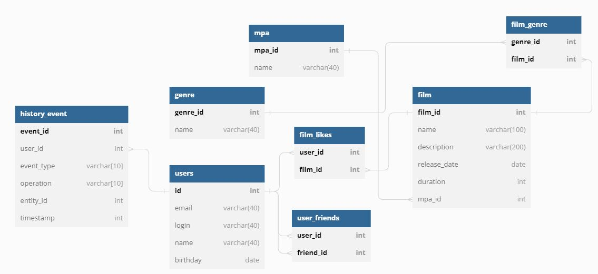

## Проект java-filmorate
Схема базы данных проекта сделана с помощью ресурса [dbdiagram](https://dbdiagram.io/)

[Посмотреть текстовое представление схемы базы данных можно здесь](src/main/resources/schema.txt)

## В рамках группового проекта были реализованы следующие функциональности:
1) Добавление режиссеров в фильмы
2) Удаление фильмов и пользователей
3) Функциональность "Общие фильмы"
4) Вывод самых популярных фильмов по жанру и годам
5) Функциональность "Рекомендации"
6) Функциональность "Отзывы"
7) Функциональность "Поиск"
8) Функциональность "Лента событий"

